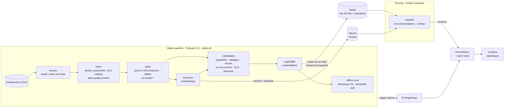
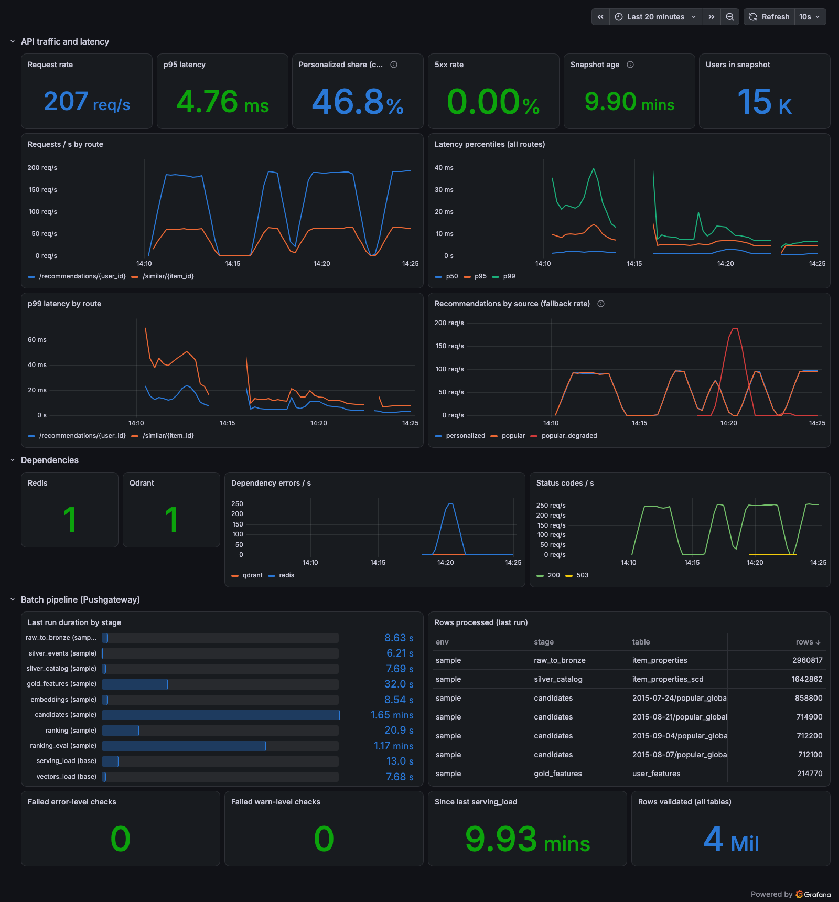

# Spark Recommendation Platform

An end-to-end e-commerce recommender on Apache Spark, built on the [Retailrocket](https://www.kaggle.com/datasets/retailrocket/ecommerce-dataset) dataset: 2.76M interactions, 1.4M visitors, 417K products.

- **Data:** raw events → validated bronze/silver/gold tables → point-in-time features.
- **Models:** 6 candidate generators (ALS, session co-occurrence, item2vec + Qdrant, popularity variants) → a LightGBM LambdaRank re-ranker.
- **Evaluation:** bootstrap confidence intervals, and a simulated A/B test.
- **Serving:** FastAPI + Redis serving, with Prometheus/Grafana monitoring.

Every number below was measured on a laptop (Apple M4, 16 GB) and comes from [docs/RESULTS.md](docs/RESULTS.md).

## Results
**Held-out test split** (cutoff 2015-09-04, 142,838 visitors). NDCG@10 with 95% bootstrap CIs. Ranker vs baseline, paired over the same visitors ([EXPERIMENT.md](docs/EXPERIMENT.md)):

| ranker vs | all visitors | returning (10%) | new / cold-start (90%) |
|---|---|---|---|
| global popularity | **+353%** [+330%, +378%] | +3,821% | −9.1% [−11.5%, −6.6%] |
| ALS (rank 128) | **+541%** [+498%, +587%] | +424% | n/a (ALS has no cold lists) |
| best single source (recent items) | **+30.6%** [+28.9%, +32.5%] | +6.9% [+6.3%, +7.6%] | n/a |
| hand-written blend | −0.0% [−0.6%, +0.7%] (tie) | **+2.3%** [+1.8%, +2.7%] | −9.1% |

→ **Serving policy:** ranker for returning visitors, popularity for new ones. A 50/50 online A/B would need ~17× this traffic to detect the +2.3%.

| | |
|---|---|
| Data quality | 460 duplicates dropped, 0 rejected rows. Row counts reconcile exactly bronze → silver |
| Leakage | Future-data injection test: every feature row stays identical. It caught a real lookahead bug |
| Candidate recall | Union of sources R@100 = 0.307 for returning visitors (best single source: 0.194) |
| Vector search (Qdrant HNSW) | recall@10 = 0.996 vs exact search, p95 4.8 ms |
| API latency (~250 req/s) | p50 4 ms, p95 8 ms, p99 11 ms (personalized). 2,839 req/s at saturation, 0 errors |
| Redis outage drill | 200/200 requests served (degraded mode, p95 2.1 ms). Auto-recovers when Redis returns |
| Spark tuning | Broadcast join −44% CPU, AQE −27% wall, caching −20% CPU, pruning −99% bytes read. Salting measured *slower* here |

## Architecture


## Quickstart
**Prerequisites:**
- [uv](https://docs.astral.sh/uv/) (installs Python 3.12)
- Java 17 or 21
- Docker (OrbStack or Docker Desktop) for the serving stack
- On macOS: `brew install libomp` (needed by LightGBM)

```bash
make setup        # uv sync + pre-commit hooks
make check        # ruff + mypy --strict + 105 tests (Spark, Qdrant integration if running)
make demo         # no download needed: synthetic Retailrocket-shaped data -> full pipeline -> eval (~2.5 min)
```

**With the real data:** put `events.csv`, `item_properties_part{1,2}.csv` and `category_tree.csv` in `data/raw/`.
```bash
make all                  # 5% visitor sample: sample -> bronze -> ... -> ranker -> eval
make data eval ENV=base   # full dataset: ~40 min on an M4, summed from measured stage times
                          # (candidates incl. ALS rank 128 and ranker scoring dominate)
make perf ENV=base        # Spark optimization before/after benchmarks
```

**Serving and monitoring:**
```bash
make up                   # Qdrant, Redis, API :8000, Pushgateway, Prometheus :9090, Grafana :3000
make serve-load ENV=base  # publish the latest snapshot to Redis + Qdrant, flip the live version
curl "localhost:8000/recommendations/568980?n=5"
curl "localhost:8000/similar/318282?n=5&available_only=true"
make loadtest-ids && make loadtest
```
Every target is listed by `make help`. The API contract is in [docs/API.md](docs/API.md), and operations in [docs/RUNBOOK.md](docs/RUNBOOK.md).



## Documentation
| doc | what's in it |
|---|---|
| [docs/DESIGN.md](docs/DESIGN.md) | ALS vs embeddings, batch vs online, offline/online parity, scaling to EMR/K8s, next steps |
| [docs/RESULTS.md](docs/RESULTS.md) | Every measured number, phase by phase (data, features, candidates, vectors, ranking, eval, serving, observability, performance) |
| [docs/EXPERIMENT.md](docs/EXPERIMENT.md) | Ranker vs blend experiment: hypothesis, design, results, decision |
| [docs/EVAL_REPORT.md](docs/EVAL_REPORT.md) | Generated by `make eval`: per-policy metrics, comparisons, beyond-accuracy |
| [docs/DECISIONS.md](docs/DECISIONS.md) | 14 ADRs (what, why, trade-offs) |
| [docs/feature_contract.md](docs/feature_contract.md) | Generated feature schema: name, type, window, null handling |
| [docs/API.md](docs/API.md) · [openapi.json](docs/openapi.json) | Serving API contract |
| [docs/RUNBOOK.md](docs/RUNBOOK.md) | Stale recs, Redis/Qdrant down, rollback, bad models, latency |
| [PLAN.md](PLAN.md) | The phased build plan this repo followed |

## Pipeline tables
| Layer | Table | Notes |
|---|---|---|
| bronze | `events`, `item_properties`, `category_tree` | Typed with `try_cast`, every input row kept. Events partitioned by `event_date` |
| silver | `events`, `_rejected/events` | Deduplicated valid events. Invalid rows quarantined with a `reject_reason` |
| silver | `item_properties_scd`, `categories`, `catalog_latest` | Versioned catalog `[valid_from, valid_to)` for as-of joins (ADR-005) and the category tree |
| gold | `events_enriched`, `cutoffs`, `labels` | Sessions + point-in-time category, train/val/test cutoffs, graded future interactions |
| gold | `user_features`, `user_category_affinity`, `item_features` | Point-in-time features per cutoff ([contract](docs/feature_contract.md)) |
| gold | `candidates`, `item_neighbors`, `item_embeddings` | 6 sources × top-100 per visitor, co-occurrence neighbors, item2vec vectors |
| gold | `ranking_train`, `models/ranker`, `ranked` | LambdaRank training sample, model + metadata, ranked top-100 for val/test |
| Redis | `recsys:<version>:*` | Serving snapshot: per-visitor top-50 + popularity, 7-day TTL, atomic `current` pointer |
| Qdrant | `items_<cutoff>` | Item vectors + category/availability payload |

Each stage writes a run report to `<layer>/_reports/<stage>.json`. Data-quality reports go to `<layer>/_validation/`, and an error-severity failure stops the stage.

## Layout
```
configs/         base.yaml + env overlays (sample, synth, als_sweep_round2)
src/recsys/
  ingest/        raw -> bronze, sampling, synthetic data
  clean/         bronze -> silver, versioned catalog, validation checks
  features/      sessions, point-in-time user/item features, labels, contract
  candidates/    popularity, category, recent items, co-occurrence, ALS, item2vec, evaluation
  embeddings/    item2vec training, exact + Qdrant indexes, vector benchmark
  ranking/       example builder, LightGBM LambdaRank, blend baseline
  eval/          metrics, bootstrap/A-B stats, figures, report
  serving/       Redis snapshot store + loader, FastAPI app, Qdrant similar items
  observability/ JSON logging, API metrics, Pushgateway pipeline metrics
  perf/          Spark benchmark harness (REST API metrics)
tests/           unit + synthetic end-to-end + leakage + Qdrant integration + load test
docker/          API image, Prometheus config + alerts, Grafana provisioning + dashboard
docs/            design, results, experiment, ADRs, API, runbook, figures
```

## Configuration
Configs live in `configs/`. `base.yaml` is always loaded, and an environment file is deep-merged on top: `--env sample`, `ENV=synth`, or `RECSYS_ENV`. Nothing is hardcoded: windows, weights, split dates, model parameters and serving TTLs are all config.
