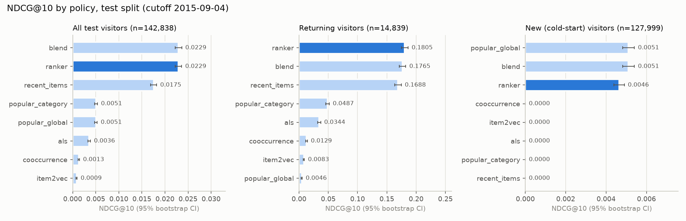
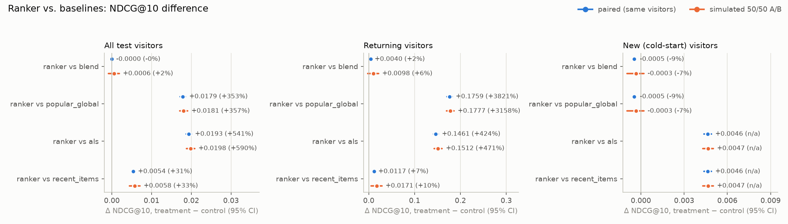
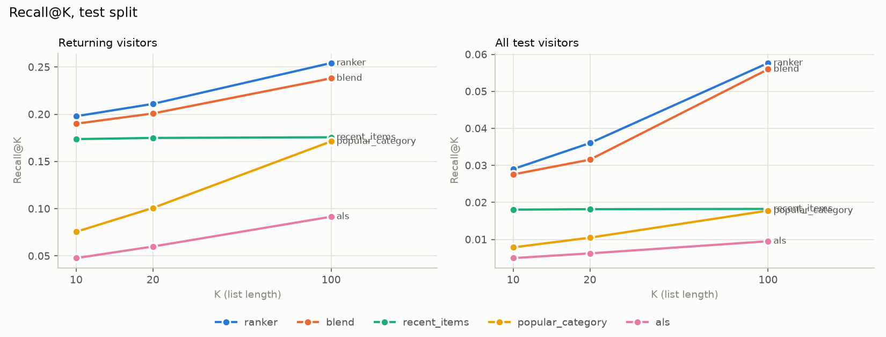

# Evaluation report (test split)

<!-- Generated by `make eval` (recsys.eval.offline). Do not edit. -->

- Cutoff 2015-09-04; 142,838 visitors with ≥ 1 future interaction (14,839 returning).
- Bootstrap: 2,000 resamples of visitors, 95% percentile intervals.
- Simulated A/B: visitors hashed 50/50 with salt `ab-sim-2026-10` (treatment share 0.502); each arm scored only with its own policy.

## Policy summary

### all (142,838 visitors)

| policy | NDCG@10 (95% CI) | Recall@10 | Recall@20 | Recall@100 | MAP@10 | HR@10 |
|---|---|---:|---:|---:|---:|---:|
| `blend` | 0.0229 [0.0222, 0.0236] | 0.0276 | 0.0316 | 0.0560 | 0.0203 | 0.0329 |
| `ranker` | 0.0229 [0.0222, 0.0236] | 0.0290 | 0.0360 | 0.0577 | 0.0199 | 0.0346 |
| `recent_items` | 0.0175 [0.0169, 0.0182] | 0.0180 | 0.0182 | 0.0182 | 0.0165 | 0.0215 |
| `popular_category` | 0.0051 [0.0048, 0.0054] | 0.0079 | 0.0105 | 0.0178 | 0.0038 | 0.0100 |
| `popular_global` | 0.0051 [0.0048, 0.0053] | 0.0086 | 0.0119 | 0.0353 | 0.0036 | 0.0109 |
| `als` | 0.0036 [0.0033, 0.0038] | 0.0050 | 0.0062 | 0.0095 | 0.0028 | 0.0068 |
| `cooccurrence` | 0.0013 [0.0012, 0.0015] | 0.0019 | 0.0024 | 0.0030 | 0.0009 | 0.0034 |
| `item2vec` | 0.0009 [0.0007, 0.0010] | 0.0014 | 0.0020 | 0.0041 | 0.0006 | 0.0023 |

### warm (14,839 visitors)

| policy | NDCG@10 (95% CI) | Recall@10 | Recall@20 | Recall@100 | MAP@10 | HR@10 |
|---|---|---:|---:|---:|---:|---:|
| `ranker` | 0.1805 [0.1749, 0.1863] | 0.1980 | 0.2110 | 0.2543 | 0.1666 | 0.2321 |
| `blend` | 0.1765 [0.1711, 0.1823] | 0.1900 | 0.2008 | 0.2381 | 0.1638 | 0.2245 |
| `recent_items` | 0.1688 [0.1633, 0.1746] | 0.1737 | 0.1749 | 0.1756 | 0.1590 | 0.2068 |
| `popular_category` | 0.0487 [0.0459, 0.0516] | 0.0756 | 0.1008 | 0.1713 | 0.0369 | 0.0958 |
| `als` | 0.0344 [0.0320, 0.0370] | 0.0477 | 0.0600 | 0.0915 | 0.0272 | 0.0652 |
| `cooccurrence` | 0.0129 [0.0115, 0.0142] | 0.0183 | 0.0227 | 0.0287 | 0.0090 | 0.0329 |
| `item2vec` | 0.0083 [0.0072, 0.0093] | 0.0132 | 0.0193 | 0.0395 | 0.0055 | 0.0221 |
| `popular_global` | 0.0046 [0.0038, 0.0055] | 0.0076 | 0.0116 | 0.0392 | 0.0032 | 0.0122 |

### cold (127,999 visitors)

| policy | NDCG@10 (95% CI) | Recall@10 | Recall@20 | Recall@100 | MAP@10 | HR@10 |
|---|---|---:|---:|---:|---:|---:|
| `blend` | 0.0051 [0.0048, 0.0054] | 0.0087 | 0.0119 | 0.0349 | 0.0037 | 0.0107 |
| `popular_global` | 0.0051 [0.0048, 0.0054] | 0.0087 | 0.0119 | 0.0349 | 0.0037 | 0.0107 |
| `ranker` | 0.0046 [0.0044, 0.0049] | 0.0094 | 0.0158 | 0.0349 | 0.0029 | 0.0117 |
| `recent_items` | 0.0000 [0.0000, 0.0000] | 0.0000 | 0.0000 | 0.0000 | 0.0000 | 0.0000 |
| `popular_category` | 0.0000 [0.0000, 0.0000] | 0.0000 | 0.0000 | 0.0000 | 0.0000 | 0.0000 |
| `als` | 0.0000 [0.0000, 0.0000] | 0.0000 | 0.0000 | 0.0000 | 0.0000 | 0.0000 |
| `item2vec` | 0.0000 [0.0000, 0.0000] | 0.0000 | 0.0000 | 0.0000 | 0.0000 | 0.0000 |
| `cooccurrence` | 0.0000 [0.0000, 0.0000] | 0.0000 | 0.0000 | 0.0000 | 0.0000 | 0.0000 |

## Comparisons

Relative lift = treatment / control − 1 (n/a when the control scores 0). `p_not_better` = share of bootstrap replicates with treatment − control ≤ 0. Significant = the 95% CI of the absolute difference excludes 0.

| metric | treatment vs control | segment | design | control | treatment | lift (95% CI) | p_not_better | significant |
|---|---|---|---|---:|---:|---|---:|---|
| ndcg_at_10 | ranker vs blend | all | paired | 0.0229 | 0.0229 | -0.0% [-0.6%, +0.7%] | 0.537 | no |
| ndcg_at_10 | ranker vs blend | all | ab_simulation | 0.0226 | 0.0231 | +2.4% [-3.5%, +8.4%] | 0.215 | no |
| ndcg_at_10 | ranker vs blend | warm | paired | 0.1765 | 0.1805 | +2.3% [+1.8%, +2.7%] | 0.000 | yes |
| ndcg_at_10 | ranker vs blend | warm | ab_simulation | 0.1736 | 0.1834 | +5.6% [-1.0%, +12.7%] | 0.049 | no |
| ndcg_at_10 | ranker vs blend | cold | paired | 0.0051 | 0.0046 | -9.1% [-11.5%, -6.6%] | 1.000 | yes |
| ndcg_at_10 | ranker vs blend | cold | ab_simulation | 0.0050 | 0.0047 | -6.9% [-17.8%, +4.4%] | 0.888 | no |
| ndcg_at_10 | ranker vs popular_global | all | paired | 0.0051 | 0.0229 | +353.1% [+329.7%, +377.6%] | 0.000 | yes |
| ndcg_at_10 | ranker vs popular_global | all | ab_simulation | 0.0051 | 0.0231 | +356.7% [+319.3%, +400.1%] | 0.000 | yes |
| ndcg_at_10 | ranker vs popular_global | warm | paired | 0.0046 | 0.1805 | +3820.7% [+3189.0%, +4609.3%] | 0.000 | yes |
| ndcg_at_10 | ranker vs popular_global | warm | ab_simulation | 0.0056 | 0.1834 | +3157.5% [+2512.9%, +4068.6%] | 0.000 | yes |
| ndcg_at_10 | ranker vs popular_global | cold | paired | 0.0051 | 0.0046 | -9.1% [-11.5%, -6.6%] | 1.000 | yes |
| ndcg_at_10 | ranker vs popular_global | cold | ab_simulation | 0.0050 | 0.0047 | -6.9% [-17.8%, +4.4%] | 0.888 | no |
| ndcg_at_10 | ranker vs als | all | paired | 0.0036 | 0.0229 | +540.8% [+497.8%, +587.3%] | 0.000 | yes |
| ndcg_at_10 | ranker vs als | all | ab_simulation | 0.0034 | 0.0231 | +590.2% [+517.2%, +677.1%] | 0.000 | yes |
| ndcg_at_10 | ranker vs als | warm | paired | 0.0344 | 0.1805 | +424.5% [+389.5%, +461.2%] | 0.000 | yes |
| ndcg_at_10 | ranker vs als | warm | ab_simulation | 0.0321 | 0.1834 | +470.6% [+411.9%, +541.5%] | 0.000 | yes |
| ndcg_at_10 | ranker vs als | cold | paired | 0.0000 | 0.0046 | n/a [n/a, n/a] | 0.000 | yes |
| ndcg_at_10 | ranker vs als | cold | ab_simulation | 0.0000 | 0.0047 | n/a [n/a, n/a] | 0.000 | yes |
| ndcg_at_10 | ranker vs recent_items | all | paired | 0.0175 | 0.0229 | +30.6% [+28.9%, +32.5%] | 0.000 | yes |
| ndcg_at_10 | ranker vs recent_items | all | ab_simulation | 0.0174 | 0.0231 | +33.4% [+24.7%, +42.3%] | 0.000 | yes |
| ndcg_at_10 | ranker vs recent_items | warm | paired | 0.1688 | 0.1805 | +6.9% [+6.3%, +7.6%] | 0.000 | yes |
| ndcg_at_10 | ranker vs recent_items | warm | ab_simulation | 0.1663 | 0.1834 | +10.3% [+3.2%, +17.8%] | 0.002 | yes |
| ndcg_at_10 | ranker vs recent_items | cold | paired | 0.0000 | 0.0046 | n/a [n/a, n/a] | 0.000 | yes |
| ndcg_at_10 | ranker vs recent_items | cold | ab_simulation | 0.0000 | 0.0047 | n/a [n/a, n/a] | 0.000 | yes |
| recall_at_20 | ranker vs blend | all | paired | 0.0316 | 0.0360 | +14.2% [+12.6%, +15.8%] | 0.000 | yes |
| recall_at_20 | ranker vs blend | all | ab_simulation | 0.0311 | 0.0363 | +16.7% [+10.8%, +22.7%] | 0.000 | yes |
| recall_at_20 | ranker vs blend | warm | paired | 0.2008 | 0.2110 | +5.1% [+4.1%, +6.0%] | 0.000 | yes |
| recall_at_20 | ranker vs blend | warm | ab_simulation | 0.1981 | 0.2139 | +8.0% [+1.4%, +14.7%] | 0.007 | yes |
| recall_at_20 | ranker vs blend | cold | paired | 0.0119 | 0.0158 | +32.0% [+27.8%, +36.8%] | 0.000 | yes |
| recall_at_20 | ranker vs blend | cold | ab_simulation | 0.0116 | 0.0158 | +35.7% [+23.9%, +49.3%] | 0.000 | yes |
| recall_at_20 | ranker vs popular_global | all | paired | 0.0119 | 0.0360 | +202.8% [+191.1%, +215.1%] | 0.000 | yes |
| recall_at_20 | ranker vs popular_global | all | ab_simulation | 0.0118 | 0.0363 | +206.5% [+185.5%, +229.4%] | 0.000 | yes |
| recall_at_20 | ranker vs popular_global | warm | paired | 0.0116 | 0.2110 | +1713.2% [+1486.9%, +1991.7%] | 0.000 | yes |
| recall_at_20 | ranker vs popular_global | warm | ab_simulation | 0.0136 | 0.2139 | +1469.3% [+1213.2%, +1817.2%] | 0.000 | yes |
| recall_at_20 | ranker vs popular_global | cold | paired | 0.0119 | 0.0158 | +32.0% [+27.8%, +36.8%] | 0.000 | yes |
| recall_at_20 | ranker vs popular_global | cold | ab_simulation | 0.0116 | 0.0158 | +35.7% [+23.9%, +49.3%] | 0.000 | yes |
| recall_at_20 | ranker vs als | all | paired | 0.0062 | 0.0360 | +478.4% [+445.5%, +514.5%] | 0.000 | yes |
| recall_at_20 | ranker vs als | all | ab_simulation | 0.0061 | 0.0363 | +497.3% [+443.6%, +555.6%] | 0.000 | yes |
| recall_at_20 | ranker vs als | warm | paired | 0.0600 | 0.2110 | +251.8% [+232.2%, +271.9%] | 0.000 | yes |
| recall_at_20 | ranker vs als | warm | ab_simulation | 0.0582 | 0.2139 | +267.5% [+234.7%, +304.3%] | 0.000 | yes |
| recall_at_20 | ranker vs als | cold | paired | 0.0000 | 0.0158 | n/a [n/a, n/a] | 0.000 | yes |
| recall_at_20 | ranker vs als | cold | ab_simulation | 0.0000 | 0.0158 | n/a [n/a, n/a] | 0.000 | yes |
| recall_at_20 | ranker vs recent_items | all | paired | 0.0182 | 0.0360 | +98.3% [+93.4%, +103.2%] | 0.000 | yes |
| recall_at_20 | ranker vs recent_items | all | ab_simulation | 0.0181 | 0.0363 | +100.7% [+88.9%, +112.9%] | 0.000 | yes |
| recall_at_20 | ranker vs recent_items | warm | paired | 0.1749 | 0.2110 | +20.6% [+18.9%, +22.3%] | 0.000 | yes |
| recall_at_20 | ranker vs recent_items | warm | ab_simulation | 0.1732 | 0.2139 | +23.5% [+15.9%, +31.5%] | 0.000 | yes |
| recall_at_20 | ranker vs recent_items | cold | paired | 0.0000 | 0.0158 | n/a [n/a, n/a] | 0.000 | yes |
| recall_at_20 | ranker vs recent_items | cold | ab_simulation | 0.0000 | 0.0158 | n/a [n/a, n/a] | 0.000 | yes |
| hit_rate_at_10 | ranker vs blend | all | paired | 0.0329 | 0.0346 | +5.2% [+4.0%, +6.5%] | 0.000 | yes |
| hit_rate_at_10 | ranker vs blend | all | ab_simulation | 0.0323 | 0.0350 | +8.5% [+2.7%, +14.1%] | 0.003 | yes |
| hit_rate_at_10 | ranker vs blend | warm | paired | 0.2245 | 0.2321 | +3.4% [+2.5%, +4.4%] | 0.000 | yes |
| hit_rate_at_10 | ranker vs blend | warm | ab_simulation | 0.2202 | 0.2363 | +7.3% [+1.1%, +13.9%] | 0.011 | yes |
| hit_rate_at_10 | ranker vs blend | cold | paired | 0.0107 | 0.0117 | +9.6% [+6.2%, +13.3%] | 0.000 | yes |
| hit_rate_at_10 | ranker vs blend | cold | ab_simulation | 0.0104 | 0.0118 | +13.6% [+2.0%, +26.6%] | 0.011 | yes |
| hit_rate_at_10 | ranker vs popular_global | all | paired | 0.0109 | 0.0346 | +218.9% [+205.7%, +233.6%] | 0.000 | yes |
| hit_rate_at_10 | ranker vs popular_global | all | ab_simulation | 0.0108 | 0.0350 | +224.5% [+201.1%, +251.1%] | 0.000 | yes |
| hit_rate_at_10 | ranker vs popular_global | warm | paired | 0.0122 | 0.2321 | +1802.8% [+1556.3%, +2111.0%] | 0.000 | yes |
| hit_rate_at_10 | ranker vs popular_global | warm | ab_simulation | 0.0144 | 0.2363 | +1540.6% [+1262.0%, +1914.2%] | 0.000 | yes |
| hit_rate_at_10 | ranker vs popular_global | cold | paired | 0.0107 | 0.0117 | +9.6% [+6.2%, +13.3%] | 0.000 | yes |
| hit_rate_at_10 | ranker vs popular_global | cold | ab_simulation | 0.0104 | 0.0118 | +13.6% [+2.0%, +26.6%] | 0.011 | yes |
| hit_rate_at_10 | ranker vs als | all | paired | 0.0068 | 0.0346 | +411.0% [+382.1%, +442.5%] | 0.000 | yes |
| hit_rate_at_10 | ranker vs als | all | ab_simulation | 0.0064 | 0.0350 | +442.9% [+391.2%, +498.7%] | 0.000 | yes |
| hit_rate_at_10 | ranker vs als | warm | paired | 0.0652 | 0.2321 | +255.8% [+237.2%, +277.7%] | 0.000 | yes |
| hit_rate_at_10 | ranker vs als | warm | ab_simulation | 0.0618 | 0.2363 | +282.5% [+248.3%, +321.7%] | 0.000 | yes |
| hit_rate_at_10 | ranker vs als | cold | paired | 0.0000 | 0.0117 | n/a [n/a, n/a] | 0.000 | yes |
| hit_rate_at_10 | ranker vs als | cold | ab_simulation | 0.0000 | 0.0118 | n/a [n/a, n/a] | 0.000 | yes |
| hit_rate_at_10 | ranker vs recent_items | all | paired | 0.0215 | 0.0346 | +61.2% [+57.7%, +64.7%] | 0.000 | yes |
| hit_rate_at_10 | ranker vs recent_items | all | ab_simulation | 0.0212 | 0.0350 | +65.1% [+55.3%, +75.2%] | 0.000 | yes |
| hit_rate_at_10 | ranker vs recent_items | warm | paired | 0.2068 | 0.2321 | +12.3% [+11.0%, +13.5%] | 0.000 | yes |
| hit_rate_at_10 | ranker vs recent_items | warm | ab_simulation | 0.2031 | 0.2363 | +16.3% [+9.6%, +23.5%] | 0.000 | yes |
| hit_rate_at_10 | ranker vs recent_items | cold | paired | 0.0000 | 0.0117 | n/a [n/a, n/a] | 0.000 | yes |
| hit_rate_at_10 | ranker vs recent_items | cold | ab_simulation | 0.0000 | 0.0118 | n/a [n/a, n/a] | 0.000 | yes |

## Beyond accuracy (top-10 lists)

Coverage = distinct recommended items / items in the catalog at T. Diversity = mean share of item pairs in a list with different categories. Novelty = mean −log2 of the item's 30-day visitor share (higher = less popular). Median popularity rank: 1 = most popular.

| policy | catalog coverage | distinct items | diversity | novelty (bits) | median popularity rank |
|---|---:|---:|---:|---:|---:|
| `als` | 1.72% | 7,985 | 0.366 | 14.13 | 204 |
| `blend` | 6.08% | 28,203 | 0.862 | 10.73 | 6 |
| `cooccurrence` | 3.50% | 16,223 | 0.349 | 15.07 | 222 |
| `item2vec` | 7.29% | 33,821 | 0.399 | 16.56 | 234 |
| `popular_category` | 1.42% | 6,596 | 0.092 | 14.38 | 209 |
| `popular_global` | 0.00% | 10 | 0.933 | 10.31 | 5 |
| `ranker` | 6.72% | 31,179 | 0.919 | 10.45 | 7 |
| `recent_items` | 5.38% | 24,950 | 0.563 | 15.80 | 230 |
